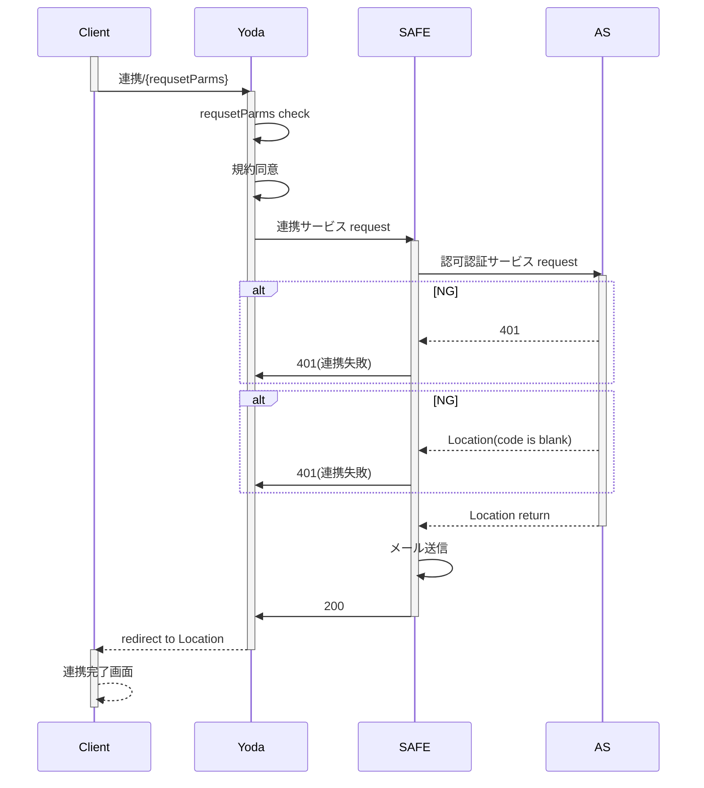

> 信息系统的设计和开发方法
#### 软件设计
+ 结构化设计
+ 面向对象设计

#### 信息系统开发方法
+ 结构化方法  
   1. 特点
   + 开发目标清晰化
   + 开发工作阶段化
   + 开发文档规范化
   + 设计方法结构化
   2. 局限性
   + 开发周期长
   + 难以适应需求变化
   + 很少考虑数据结构
+ 面对对象方法（OO）.
+ 原型化方法（快速原型法）

